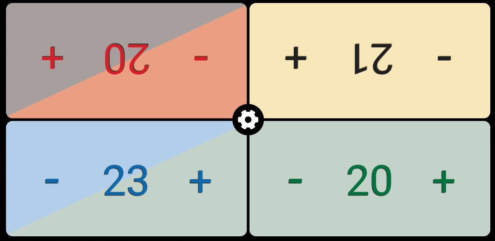
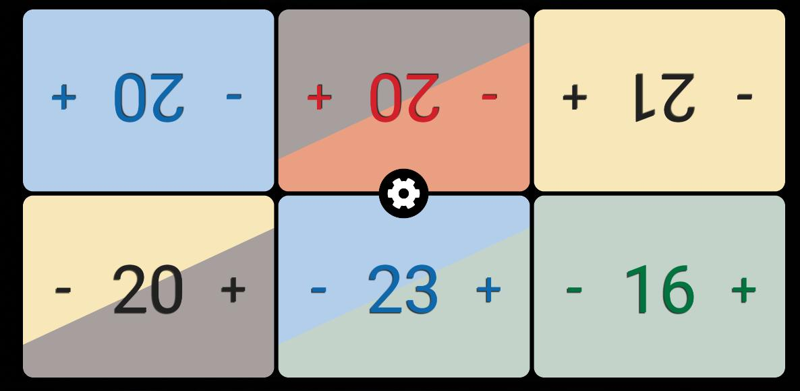
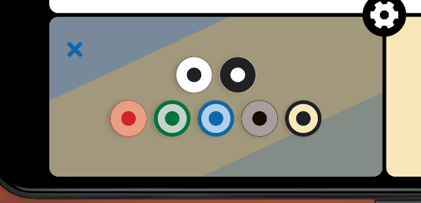
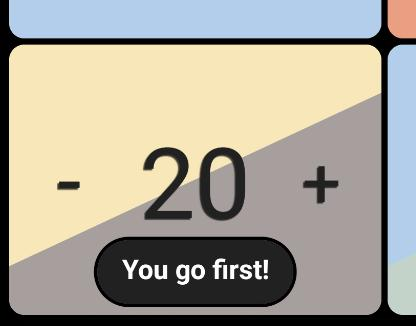
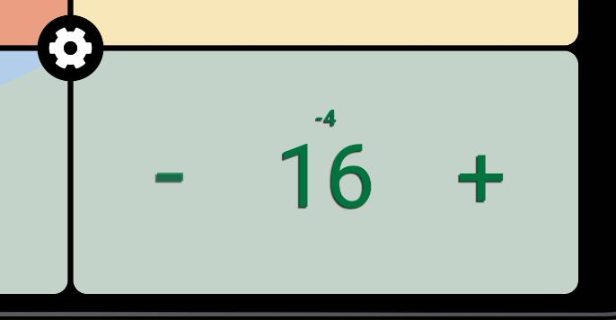

# MTG Life Counter
Open-source fan-made Magic the Gathering life counter made with React Native.

## Features:
- Supports up to 6 players:

- Start the game with 20, 30 or 40 life.

- Players can select a color or a combination of different MTG colors:

- First player can be randomly determined:

- Easily see how much life has been added/substracted:

